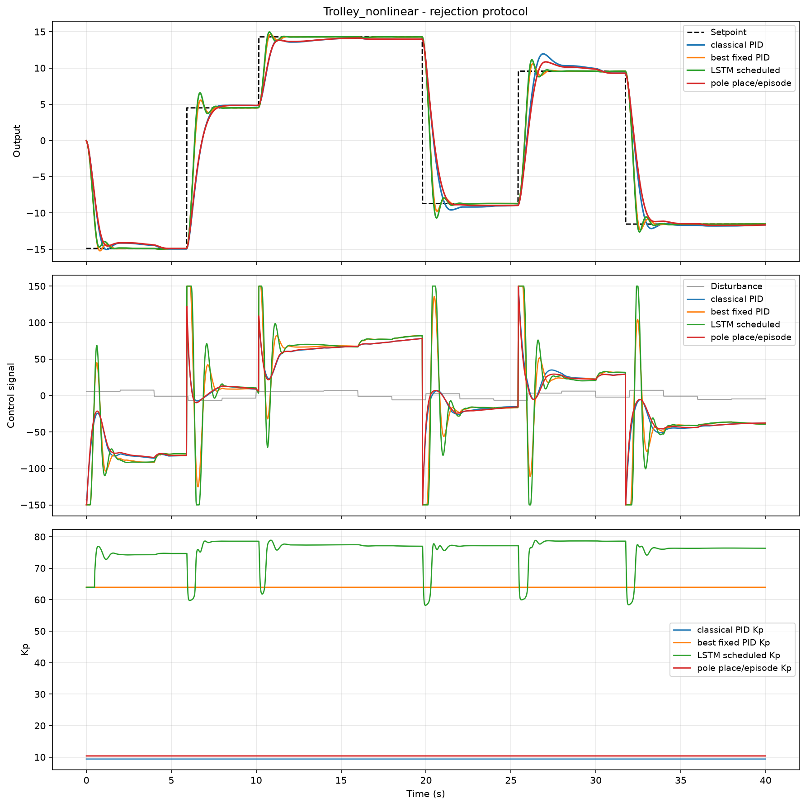
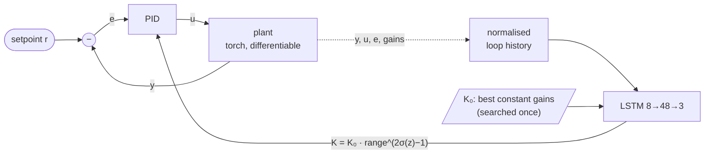

# Adaptive PID Regulation by Neural Networks

An LSTM network that schedules the gains of a PID controller online, trained
end-to-end through a differentiable simulation of the plant. An RBF network
learns a surrogate model of the plant. Tested on a trolley (mass–spring–damper)
and a thermal system, each in a linear and a nonlinear variant, against
classical tuning and the best constant gains found by search.

Bachelor's thesis project, later reworked so the experiment trains, reproduces
and compares fairly (see [Changes since the thesis](#changes-since-the-thesis)).



*Nonlinear trolley, one held-out episode. Bottom panel: the LSTM (green)
lowers Kp at every setpoint change and raises it again while holding the
position. The best constant (orange) cannot do this.*

## Contents

1. [How it works](#how-it-works)
2. [Results](#results)
3. [Quick start](#quick-start)
4. [Project layout](#project-layout)
5. [Configuration](#configuration)
6. [Changes since the thesis](#changes-since-the-thesis)
7. [Acknowledgements](#acknowledgements)

## How it works



| Piece | What it does |
|---|---|
| **Plants** | Written in torch, so the tracking loss back-propagates through the simulation into the LSTM. Gradients are exact. |
| **Residual head** | The LSTM outputs a bounded multiplicative correction around the best constant gains `K₀`. Its last layer starts at zero, so the untrained network *is* the baseline it is compared with. |
| **Features** | Eight dimensionless inputs: error, error rate, the three gains, operating point, commanded operating point, control signal. One architecture fits a plant in metres and one in kelvin. |
| **Loss** | Huber tracking error + overshoot penalty + penalty on how fast the gains change. |
| **Training** | Every episode draws a new setpoint staircase, new load disturbances and new plant parameters. Truncated BPTT over windows of 20–25 steps. |
| **Checkpoint** | Picked on validation episodes. Epoch 0 (the baseline itself) is a candidate, so the saved model is never worse than the baseline on validation. |
| **RBF surrogate** | One-step-ahead plant model (0.3–2.3 % normalised RMSE on held-out data). Optional: `loss_target: surrogate` trains through it instead of the plant, the setting you need when the real plant is not differentiable. |

## Results

Seed 42, held-out episodes, IAE (integral of absolute error), lower is better.

**How much can adaptation win at all?** `comparisons.headroom` measures the
ceiling without any network. It compares one global constant against oracles
that are searched on each episode separately, with full knowledge of that
episode's plant: first the best constant per episode, then the best 4-bin
gain table keyed on the operating point.

| Study              | one constant | best constant /episode | best table /episode | **LSTM** | headroom | LSTM gain |
|--------------------|-------------:|-----------------------:|--------------------:|---------:|---------:|----------:|
| Trolley, linear    |        34.73 |                  34.07 |               33.97 |    34.65 |   +2.2 % |    +0.2 % |
| Trolley, nonlinear |        20.84 |                  20.19 |               19.97 |**20.10** |   +4.2 % | **+3.5 %**|
| Thermal, linear    |       2822.5 |                 2742.4 |              2603.7 |**2657.9**|   +7.8 % | **+5.8 %**|
| Thermal, nonlinear |       5212.0 |                 5190.3 |              5175.3 |**5168.2**|   +0.7 % | **+0.8 %**|

**Four-arm comparison** (`comparisons.compare`, 30 episodes, final setpoint
step, with load disturbance):

| Study              | Classical rule | Best constant | **LSTM** | Pole placement /episode | LSTM better in |
|--------------------|---------------:|--------------:|---------:|------------------------:|---------------:|
| Trolley, linear    |           7.57 |      **5.35** |     5.37 |                    7.75 |           57 % |
| Trolley, nonlinear |           5.92 |          3.43 | **3.35** |                    5.70 |           80 % |
| Thermal, linear    |          777.8 |         538.7 |**528.4** |                   745.1 |           70 % |
| Thermal, nonlinear |         1442.8 |         809.3 |**801.9** |                  1361.7 |           70 % |

"LSTM better in" is the share of episodes where the LSTM beats the best
constant on IAE.

What this shows:

- **Where there is headroom, the LSTM takes most of it.** On the nonlinear
  trolley (a spring 14× stiffer at the end of travel than at the origin, plus
  dry friction) it wins 3.5 % of the possible 4.2 %. On the linear thermal
  plant it wins 5.8 % of 7.8 %: a heater that cannot cool wants different
  gains for rising and falling steps. In both cases it does this without
  knowing the plant, while the oracles are searched per episode.
- **Where there is little headroom, there is little to win.** The nonlinear
  thermal plant has only 0.7 %, since heater power, not the gains, limits
  the transients. On the linear trolley (2.2 %) the headroom comes almost
  entirely from recognising which plant was drawn, and the LSTM gets almost
  none of it. That is the open problem.
- **Gains are not free.** The LSTM uses 3–28 % more control effort than the
  best constant. All gains are capped by `control.gain_ceiling`, and on every
  plant the best constant sits at the Ki cap: the model has no sensor noise,
  so higher gains cost nothing. The cap stands in for that noise.
- **Classical rules lose to every searched controller.** They get one shot at
  an unknown plant and are conservative by design. The baseline that matters
  is the best constant.

Both tables are printed by `python -m comparisons.summary` from `results/`.

## Quick start

```sh
git clone https://github.com/vsem-azamat/neural-network-pid-regulation
cd neural-network-pid-regulation
python3 -m venv venv && source venv/bin/activate
pip install -e ".[dev]"          # Python 3.11+, CPU is enough
```

Run everything (4 studies, roughly 1.5–2 h each on a CPU, most of it the
headroom search):

```sh
python run_pipeline.py                       # all studies
python run_pipeline.py --system trolley      # one study
python run_pipeline.py --skip headroom       # skip the slowest stage
```

Or one stage at a time:

```sh
python -m simulations.analyse_plant  trolley_nonlinear  # step, phase, Bode, Nyquist
python -m learning.train_rbf         trolley_nonlinear  # RBF surrogate
python -m learning.train_lstm_pid    trolley_nonlinear  # LSTM scheduler
python -m comparisons.compare        trolley_nonlinear  # four-arm comparison
python -m comparisons.headroom       trolley_nonlinear  # adaptation ceiling
python -m comparisons.summary                           # tables above
```

Studies: `trolley`, `trolley_nonlinear`, `thermal`, `thermal_nonlinear`.
Common flags: `--seed N`, `--show`. Outputs: `weights/`, `results/*.json`,
`plots/`.

Tests and lint: `python -m pytest` (121 tests), `ruff check .`

## Project layout

```
entities/        plants (trolley, thermal) and the discrete PID
models/          LSTMAdaptivePID, SystemRBFModel
learning/        episode generation, feature extraction, training scripts
comparisons/     baselines, four-arm comparison, headroom, summary tables
simulations/     open-loop plant analysis
utils/           simulation loop and loss, metrics, classical tuning, plots
config/ymls/     one YAML per study, validated by pydantic
tests/           unit and regression tests
run_pipeline.py  all stages, all studies
```

## Configuration

Each study is one YAML file in `config/ymls/`. The main settings:

| Key | Meaning |
|---|---|
| `control.gain_ceiling` | Hard upper limit on each gain |
| `control.residual_range` | How far the LSTM may move each gain from `K₀` (×/÷ this factor) |
| `control.error_scale` | Typical error size, used to normalise loss and features |
| `scenario.randomize_plant` | Ranges of plant parameters drawn per episode |
| `scenario.disturbance_scale` | Load disturbance amplitude |
| `learning.lstm.loss_target` | `plant` (exact gradients) or `surrogate` (through the RBF) |
| `learning.lstm.gain_rate_weight` | Penalty on the rate of gain change |
| `learning.lstm.effort_weight` | Penalty on actuator movement |

## Changes since the thesis

The thesis version did not actually train: a `torch.tensor([...])` call cut
the autograd graph, so every LSTM parameter got `grad=None` and the published
figures came from an untrained network. The main fixes:

- **Gradient flow restored**, and guarded by `tests/test_gradient_flow.py`.
- **A task worth learning:** randomised setpoint staircases, load disturbances
  and plant parameters, instead of one repeated random step.
- **Operating point and actuator saturation added to the LSTM inputs**, which
  a gain schedule needs on a nonlinear plant.
- **Residual gains around the best constant**, plus checkpoint selection on
  validation episodes.
- **Fair comparison:** every controller starts from a clean state on the same
  episodes, and it is compared with a searched constant, not only with a
  tuning rule. The headroom diagnostic measures what adaptation can win.
- **Nonlinear plant variants** (hardening spring + dry friction, radiative
  heat loss).
- **Correct metrics:** overshoot, rise and settling time now work for negative
  and falling steps.
- **Correct plants and tuning:** thermal heat exchange is with ambient
  temperature, not 0 K; the Ziegler–Nichols `Kd` is fixed; the derivative acts
  on the measurement.
- **Reproducibility:** one seed for everything, a pipeline script, tests and CI.

## Acknowledgements

Bachelor's thesis, supervised by Ing. Cyril Oswald, Ph.D.
([ORCID](https://orcid.org/0000-0001-5268-2785)).
